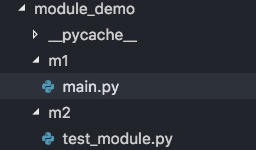

## 简介：  
关于模块是什么还不太懂的朋友，可以先看一下
[廖雪峰教程](https://www.liaoxuefeng.com/wiki/0014316089557264a6b348958f449949df42a6d3a2e542c000/0014318447437605e90206e261744c08630a836851f5183000)

  用vscode加载学长给的一个项目的时候发现导入包报错，于是查了下python包和模块的一点知识，这里简要给出两种经常碰到的情况。
  
  ---

## 一. 需主动调用的文件与被调用的模块位于同一父目录下  
如下：  
    
  
此时，可以直接在main中使用`import test_module.py`来导入这个模块，之后可用`test_module.xxx()`使用里面的方法或变量。  

## 二. 主动调用的文件与被调用的模块位于同一项目而不在同一父目录下  
如下：   
  
此时，可以把m1, m2看做两个包，因此在m2文件夹下先创建一个`__init__.py`文件，表明m2目录不是普通的目录，它已经是一个包，之后在main中添加三行代码： 
```
import sys
# 将引号内的路径变做你自己的包所在目录路径
sys.path.append(r'/Users/dong/project/python/module_demo/')
from m2 import test_module
```

大功告成！

