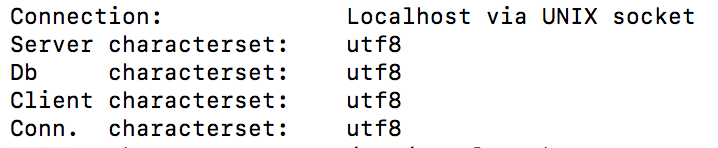

在学习python爬虫的过程中，向mysql数据库插入从豆瓣上爬到的电影数据时出现了编码问题：`Error 1366: Incorrect string value:……`  
在网上查了许多资料发现，mysql sever默认是用latin1（ISO-8859-1）编码，而Mac使用的是utf-8编码,在终端中利用`mysql -u root -p`命令连上mysql后使用`status`或`show variables like 'character%'; `可以得到mysql的字符集编码信息，如下图是使用`status`命令得到的：  
  

由于我已经修改过，所以在Server characterset一栏显示为utf8.  

---
接下来说明一下如何修改mysql sever默认编码为utf-8.   
首先进`/etc`，使用`sudo vim my.cnf`创建my.cnf文件并向里面写入以下内容：  
```
# Example MySQL config file for medium systems. 
# 
# This is for a system with little memory (32M - 64M) where MySQL plays 
# an important part, or systems up to 128M where MySQL is used together with 
# other programs (such as a web server) 
# 
# MySQL programs look for option files in a set of 
# locations which depend on the deployment platform. 
# You can copy this option file to one of those 
# locations. For information about these locations, see: 
# http://dev.mysql.com/doc/mysql/en/option-files.html 
# 
# In this file, you can use all long options that a program supports. 
# If you want to know which options a program supports, run the program 
# with the "--help" option. 
# The following options will be passed to all MySQL clients 
[client]
default-character-set=utf8
#password = your_password 
port = 3306 
socket = /tmp/mysql.sock 
# Here follows entries for some specific programs 
# The MySQL server 
[mysqld]
character-set-server=utf8
init_connect='SET NAMES utf8
port = 3306 
socket = /tmp/mysql.sock 
skip-external-locking 
key_buffer_size = 16M 
max_allowed_packet = 1M 
table_open_cache = 64 
sort_buffer_size = 512K 
net_buffer_length = 8K 
read_buffer_size = 256K 
read_rnd_buffer_size = 512K 
myisam_sort_buffer_size = 8M 
character-set-server=utf8 
init_connect='SET NAMES utf8' 
# Don't listen on a TCP/IP port at all. This can be a security enhancement, 
# if all processes that need to connect to mysqld run on the same host. 
# All interaction with mysqld must be made via Unix sockets or named pipes. 
# Note that using this option without enabling named pipes on Windows 
# (via the "enable-named-pipe" option) will render mysqld useless! 
# 
#skip-networking

# Replication Master Server (default) 
# binary logging is required for replication 
log-bin=mysql-bin

# binary logging format - mixed recommended 
binlog_format=mixed

# required unique id between 1 and 2^32 - 1 
# defaults to 1 if master-host is not set 
# but will not function as a master if omitted 
server-id = 1

# Replication Slave (comment out master section to use this) 
# 
# To configure this host as a replication slave, you can choose between 
# two methods : 
# 
# 1) Use the CHANGE MASTER TO command (fully described in our manual) - 
# the syntax is: 
# 
# CHANGE MASTER TO MASTER_HOST=<host>, MASTER_PORT=<port>, 
# MASTER_USER=<user>, MASTER_PASSWORD=<password> ; 
# 
# where you replace <host>, <user>, <password> by quoted strings and 
# <port> by the master's port number (3306 by default). 
# 
# Example: 
# 
# CHANGE MASTER TO MASTER_HOST='125.564.12.1', MASTER_PORT=3306, 
# MASTER_USER='joe', MASTER_PASSWORD='secret'; 
# 
# OR 
# 
# 2) Set the variables below. However, in case you choose this method, then 
# start replication for the first time (even unsuccessfully, for example 
# if you mistyped the password in master-password and the slave fails to 
# connect), the slave will create a master.info file, and any later 
# change in this file to the variables' values below will be ignored and 
# overridden by the content of the master.info file, unless you shutdown 
# the slave server, delete master.info and restart the slaver server. 
# For that reason, you may want to leave the lines below untouched 
# (commented) and instead use CHANGE MASTER TO (see above) 
# 
# required unique id between 2 and 2^32 - 1 
# (and different from the master) 
# defaults to 2 if master-host is set 
# but will not function as a slave if omitted 
#server-id = 2 
# 
# The replication master for this slave - required 
#master-host = <hostname> 
# 
# The username the slave will use for authentication when connecting 
# to the master - required 
#master-user = <username> 
# 
# The password the slave will authenticate with when connecting to 
# the master - required 
#master-password = <password> 
# 
# The port the master is listening on. 
# optional - defaults to 3306 
#master-port = <port> 
# 
# binary logging - not required for slaves, but recommended 
#log-bin=mysql-bin

# Uncomment the following if you are using InnoDB tables 
#innodb_data_home_dir = /usr/local/mysql/data 
#innodb_data_file_path = ibdata1:10M:autoextend 
#innodb_log_group_home_dir = /usr/local/mysql/data 
# You can set .._buffer_pool_size up to 50 - 80 % 
# of RAM but beware of setting memory usage too high 
#innodb_buffer_pool_size = 16M 
#innodb_additional_mem_pool_size = 2M 
# Set .._log_file_size to 25 % of buffer pool size 
#innodb_log_file_size = 5M 
#innodb_log_buffer_size = 8M 
#innodb_flush_log_at_trx_commit = 1 
#innodb_lock_wait_timeout = 50

[mysqldump] 
quick 
max_allowed_packet = 16M

[mysql] 
no-auto-rehash 
# Remove the next comment character if you are not familiar with SQL 
#safe-updates 
default-character-set=utf8

[myisamchk] 
key_buffer_size = 20M 
sort_buffer_size = 20M 
read_buffer = 2M 
write_buffer = 2M

[mysqlhotcopy] 
interactive-timeout
```
之后保存退出，重启mysql即可。  
详细操作或有更多问题可参考这位大神的帖子：[mac终端下修改MySQL的编码格式--找不到my-default.cnf及my.cnf](https://www.cnblogs.com/gerald-x/p/6913877.html) 
