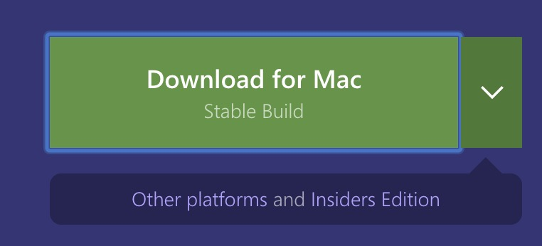
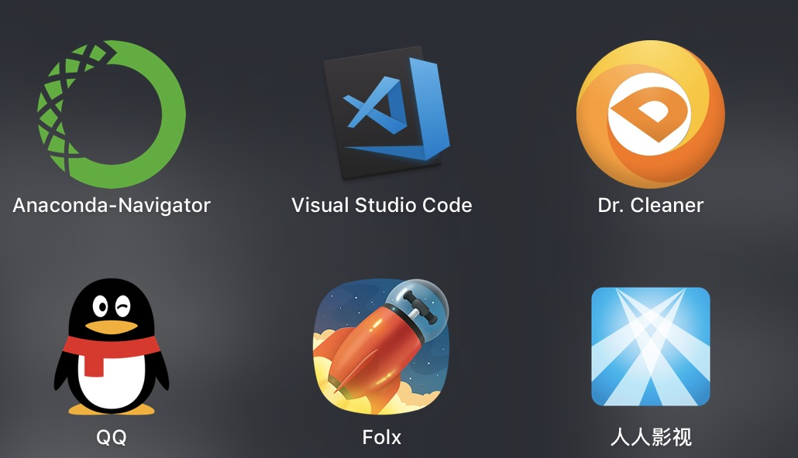
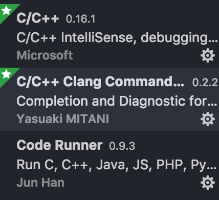
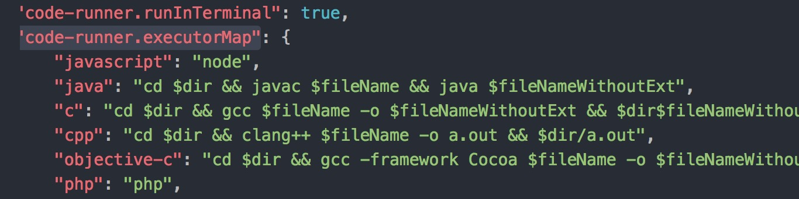
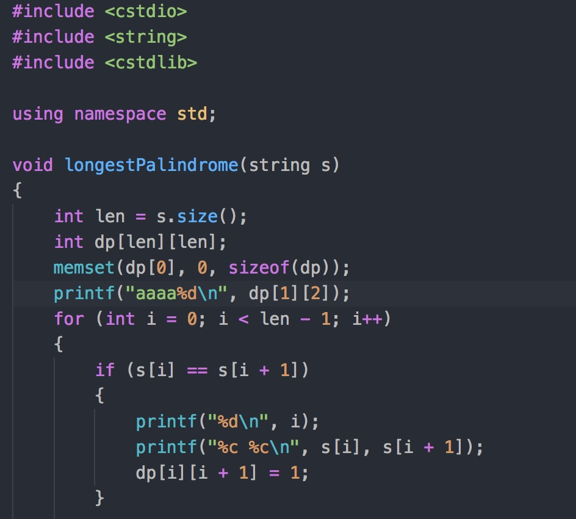

## 1. VSCode的下载与安装

首先，到[VSCode的官网](https://code.visualstudio.com/)下载，如图： 
  
   

下载后将解压的文件的放入应用程序即可。   
  
  
 
  
## 2. 安装C++的插件  

安装如下三个插件：  
  
  

安装完后记得重新加载一下VSCode。  
  
## 3. 修改用户设置  
点左下角设置图标选择“设置”  
**注意**：用户设置里必须添加  
>`"code-runner.runInTerminal": true,`

不然的话每次运行代码有输入语句的时候无法读取输入。  
之后就可以文件直接右键点击运行了，后台会自动调用编译命令和执行命令，如果想将g++更换为clang可以在用户设置里搜索`"code-runner.executorMap"`，这里面都是当你右键运行代码的时候后台会执行的代码，只要将g++改成clang就可以了，  
如图：
   

附上一张代码图：  

  
  
  大功告成！！

